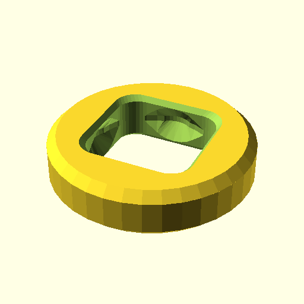
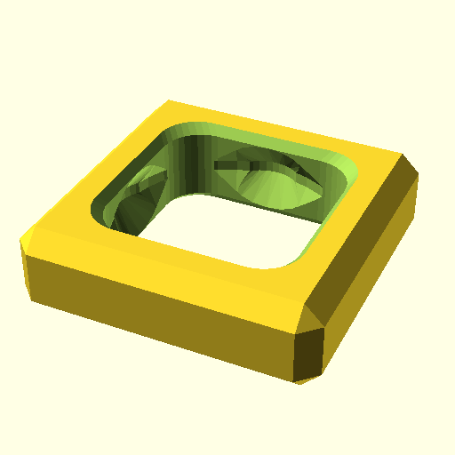
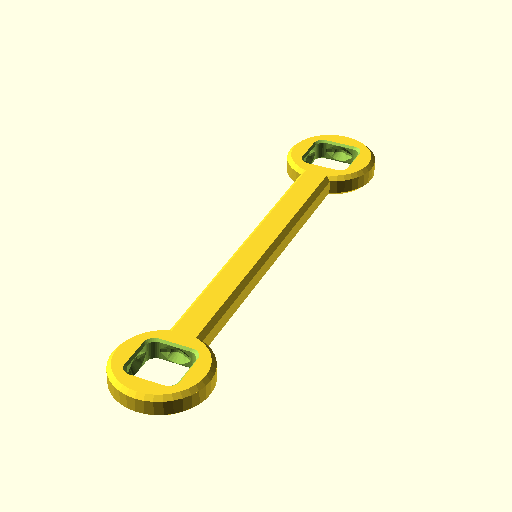
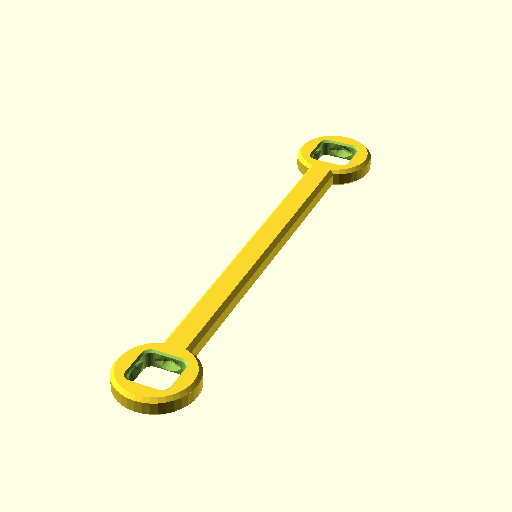
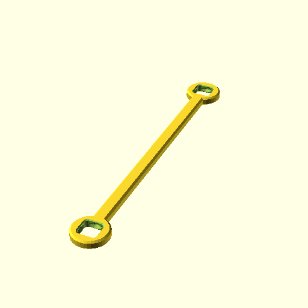
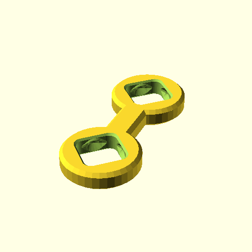
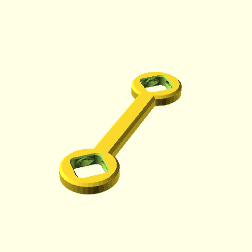
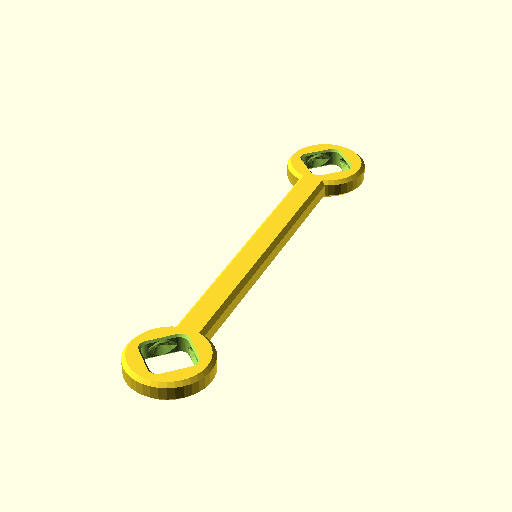

**BB20Ring();**

    use <BB20_bar.scad>
    BB20Ring();

[BB20Ring.3mf](BB20Ring.3mf)
[BB20Ring.stl](BB20Ring.stl)

**BB20LockSq();**

    use <BB20_bar.scad>
    BB20LockSq();

[BB20LockSq.3mf](BB20LockSq.3mf)
[BB20LockSq.stl](BB20LockSq.stl)

**BB20Bar(2);**

    use <BB20_bar.scad>
    BB20Bar(2);

[BB20Bar_2.3mf](BB20Bar_2.3mf)
[BB20Bar_2.stl](BB20Bar_2.stl)

**BB20Bar(3);**

    use <BB20_bar.scad>
    BB20Bar(3);

[BB20Bar_3.3mf](BB20Bar_3.3mf)
[BB20Bar_3.stl](BB20Bar_3.stl)

**BB20Bar(4);**

    use <BB20_bar.scad>
    BB20Bar(4);

[BB20Bar_4.3mf](BB20Bar_4.3mf)
[BB20Bar_4.stl](BB20Bar_4.stl)

**BB20Bar(5);**

    use <BB20_bar.scad>
    BB20Bar(5);

[BB20Bar_5.3mf](BB20Bar_5.3mf)
[BB20Bar_5.stl](BB20Bar_5.stl)

**BB20Bar(6);**

    use <BB20_bar.scad>
    BB20Bar(6);

[BB20Bar_6.3mf](BB20Bar_6.3mf)
[BB20Bar_6.stl](BB20Bar_6.stl)

**BB20Bar(8);**

    use <BB20_bar.scad>
    BB20Bar(8);

[BB20Bar_8.3mf](BB20Bar_8.3mf)
[BB20Bar_8.stl](BB20Bar_8.stl)

**BB20BarSq(2);**

    use <BB20_bar.scad>
    BB20BarSq(2);

[BB20BarSq_2.3mf](BB20BarSq_2.3mf)
[BB20BarSq_2.stl](BB20BarSq_2.stl)

**BB20BarSq(3);**

    use <BB20_bar.scad>
    BB20BarSq(3);

[BB20BarSq_3.3mf](BB20BarSq_3.3mf)
[BB20BarSq_3.stl](BB20BarSq_3.stl)

**BB20BarSq(4);**

    use <BB20_bar.scad>
    BB20BarSq(4);

[BB20BarSq_4.3mf](BB20BarSq_4.3mf)
[BB20BarSq_4.stl](BB20BarSq_4.stl)

