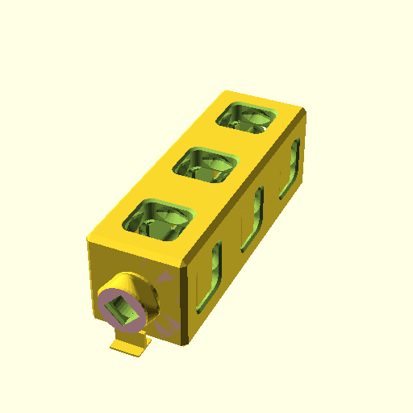

**BB20Beam([1,1,1]);**

    use <BB20_beam.scad>
    BB20Beam([1,1,1]);

[BB20Beam_1x1x1.3mf](BB20Beam_1x1x1.3mf)
[BB20Beam_1x1x1.stl](BB20Beam_1x1x1.stl)

**BB20Beam1m([1,1,1]);**

    use <BB20_beam.scad>
    BB20Beam1m([1,1,1]);

[BB20Beam1m_1x1x1.3mf](BB20Beam1m_1x1x1.3mf)
[BB20Beam1m_1x1x1.stl](BB20Beam1m_1x1x1.stl)

**BB20Beam2m([1,1,1]);**

    use <BB20_beam.scad>
    BB20Beam2m([1,1,1]);

[BB20Beam2m_1x1x1.3mf](BB20Beam2m_1x1x1.3mf)
[BB20Beam2m_1x1x1.stl](BB20Beam2m_1x1x1.stl)

**BB20Beam([2,4,1]);**

    use <BB20_beam.scad>
    BB20Beam([2,4,1]);

[BB20Beam_2x4x1.3mf](BB20Beam_2x4x1.3mf)
[BB20Beam_2x4x1.stl](BB20Beam_2x4x1.stl)

**BB20Lenker();**

    use <BB20_beam.scad>
    BB20Lenker();

[BB20Lenker.3mf](BB20Lenker.3mf)
[BB20Lenker.stl](BB20Lenker.stl)

**BB20Beam([2,8,1]);**

    use <BB20_beam.scad>
    BB20Beam([2,8,1]);

[BB20Beam_2x8x1.3mf](BB20Beam_2x8x1.3mf)
[BB20Beam_2x8x1.stl](BB20Beam_2x8x1.stl)

**BB20Beam([2,10,1]);**

    use <BB20_beam.scad>
    BB20Beam([2,10,1]);

[BB20Beam_2x10x1.3mf](BB20Beam_2x10x1.3mf)
[BB20Beam_2x10x1.stl](BB20Beam_2x10x1.stl)

**BB20Beam([1,2,1]);**

    use <BB20_beam.scad>
    BB20Beam([1,2,1]);

[BB20Beam_1x2x1.3mf](BB20Beam_1x2x1.3mf)
[BB20Beam_1x2x1.stl](BB20Beam_1x2x1.stl)

**BB20Beam([1,3,1]);**

    use <BB20_beam.scad>
    BB20Beam([1,3,1]);

[BB20Beam_1x3x1.3mf](BB20Beam_1x3x1.3mf)
[BB20Beam_1x3x1.stl](BB20Beam_1x3x1.stl)

**BB20Beam([1,4,1]);**

    use <BB20_beam.scad>
    BB20Beam([1,4,1]);

[BB20Beam_1x4x1.3mf](BB20Beam_1x4x1.3mf)
[BB20Beam_1x4x1.stl](BB20Beam_1x4x1.stl)

**BB20Beam1m([1,2,1]);**

    use <BB20_beam.scad>
    BB20Beam1m([1,2,1]);

[BB20Beam1m_1x2x1.3mf](BB20Beam1m_1x2x1.3mf)
[BB20Beam1m_1x2x1.stl](BB20Beam1m_1x2x1.stl)

**BB20Beam1m([1,3,1]);**

    use <BB20_beam.scad>
    BB20Beam1m([1,3,1]);

[BB20Beam1m_1x3x1.3mf](BB20Beam1m_1x3x1.3mf)
[BB20Beam1m_1x3x1.stl](BB20Beam1m_1x3x1.stl)

**BB20Beam1m([1,4,1]);**

    use <BB20_beam.scad>
    BB20Beam1m([1,4,1]);

[BB20Beam1m_1x4x1.3mf](BB20Beam1m_1x4x1.3mf)
[BB20Beam1m_1x4x1.stl](BB20Beam1m_1x4x1.stl)

**BB20Beam2m([1,2,1]);**

    use <BB20_beam.scad>
    BB20Beam2m([1,2,1]);

[BB20Beam2m_1x2x1.3mf](BB20Beam2m_1x2x1.3mf)
[BB20Beam2m_1x2x1.stl](BB20Beam2m_1x2x1.stl)

**BB20Beam2m([1,3,1]);**

    use <BB20_beam.scad>
    BB20Beam2m([1,3,1]);

[BB20Beam2m_1x3x1.3mf](BB20Beam2m_1x3x1.3mf)
[BB20Beam2m_1x3x1.stl](BB20Beam2m_1x3x1.stl)

**BB20Beam2m([1,4,1]);**

    use <BB20_beam.scad>
    BB20Beam2m([1,4,1]);

[BB20Beam2m_1x4x1.3mf](BB20Beam2m_1x4x1.3mf)
[BB20Beam2m_1x4x1.stl](BB20Beam2m_1x4x1.stl)

**BB20Beam([1,5,1]);**

    use <BB20_beam.scad>
    BB20Beam([1,5,1]);

[BB20Beam_1x5x1.3mf](BB20Beam_1x5x1.3mf)
[BB20Beam_1x5x1.stl](BB20Beam_1x5x1.stl)

**BB20Beam([1,6,1]);**

    use <BB20_beam.scad>
    BB20Beam([1,6,1]);

[BB20Beam_1x6x1.3mf](BB20Beam_1x6x1.3mf)
[BB20Beam_1x6x1.stl](BB20Beam_1x6x1.stl)

**BB20Beam([1,8,1]);**

    use <BB20_beam.scad>
    BB20Beam([1,8,1]);

[BB20Beam_1x8x1.3mf](BB20Beam_1x8x1.3mf)
[BB20Beam_1x8x1.stl](BB20Beam_1x8x1.stl)

