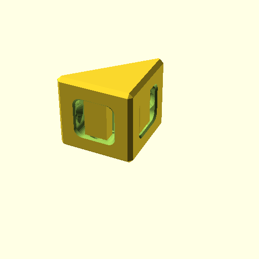
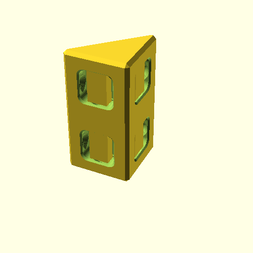
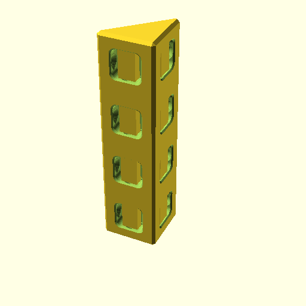
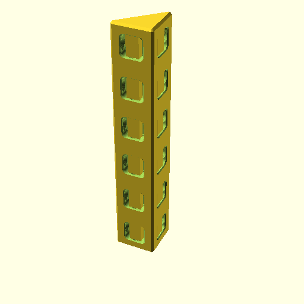
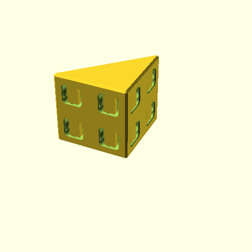
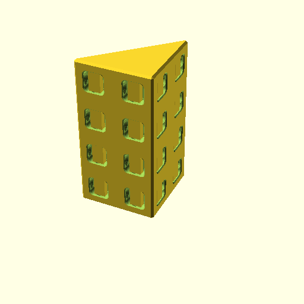
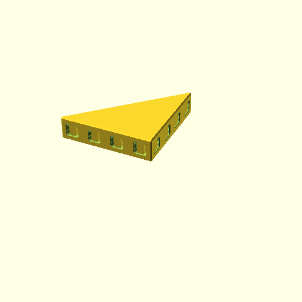
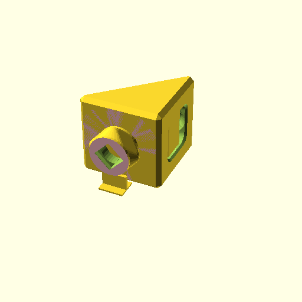

**BB20Brick45([1,1,1]);**

    use <BB20_beam45.scad>
    BB20Brick45([1,1,1]);

[BB20Brick45_1x1x1.3mf](BB20Brick45_1x1x1.3mf)
[BB20Brick45_1x1x1.stl](BB20Brick45_1x1x1.stl)

**BB20Brick45([1,1,2]);**

    use <BB20_beam45.scad>
    BB20Brick45([1,1,2]);

[BB20Brick45_1x1x2.3mf](BB20Brick45_1x1x2.3mf)
[BB20Brick45_1x1x2.stl](BB20Brick45_1x1x2.stl)

**BB20Brick45([1,1,4]);**

    use <BB20_beam45.scad>
    BB20Brick45([1,1,4]);

[BB20Brick45_1x1x4.3mf](BB20Brick45_1x1x4.3mf)
[BB20Brick45_1x1x4.stl](BB20Brick45_1x1x4.stl)

**BB20Brick45([1,1,6]);**

    use <BB20_beam45.scad>
    BB20Brick45([1,1,6]);

[BB20Brick45_1x1x6.3mf](BB20Brick45_1x1x6.3mf)
[BB20Brick45_1x1x6.stl](BB20Brick45_1x1x6.stl)

**BB20Brick45([2,2,1]);**

    use <BB20_beam45.scad>
    BB20Brick45([2,2,1]);

[BB20Brick45_2x2x1.3mf](BB20Brick45_2x2x1.3mf)
[BB20Brick45_2x2x1.stl](BB20Brick45_2x2x1.stl)

**BB20Brick45([2,2,2]);**

    use <BB20_beam45.scad>
    BB20Brick45([2,2,2]);

[BB20Brick45_2x2x2.3mf](BB20Brick45_2x2x2.3mf)
[BB20Brick45_2x2x2.stl](BB20Brick45_2x2x2.stl)

**BB20Brick45([2,2,4]);**

    use <BB20_beam45.scad>
    BB20Brick45([2,2,4]);

[BB20Brick45_2x2x4.3mf](BB20Brick45_2x2x4.3mf)
[BB20Brick45_2x2x4.stl](BB20Brick45_2x2x4.stl)

**BB20Brick45([4,4,1]);**

    use <BB20_beam45.scad>
    BB20Brick45([4,4,1]);

[BB20Brick45_4x4x1.3mf](BB20Brick45_4x4x1.3mf)
[BB20Brick45_4x4x1.stl](BB20Brick45_4x4x1.stl)

**BB20Brick45([1,1,1], peg=1);**

    use <BB20_beam45.scad>
    BB20Brick45([1,1,1], peg=1);

[BB20Brick45_1x1x1_peg_1.3mf](BB20Brick45_1x1x1_peg_1.3mf)
[BB20Brick45_1x1x1_peg_1.stl](BB20Brick45_1x1x1_peg_1.stl)

