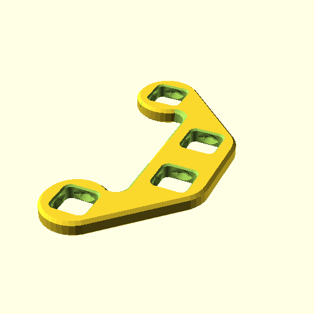
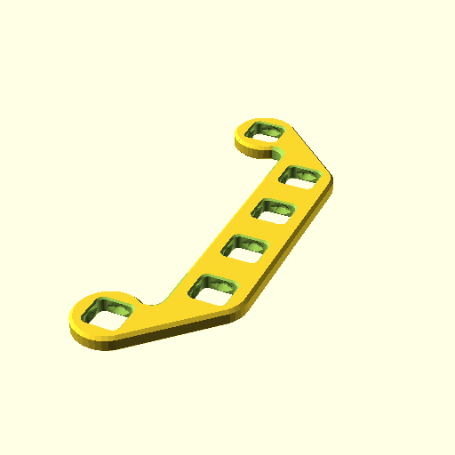

**BB20Brace(3);**

    use <BB20_brace.scad>
    BB20Brace(3);

[BB20Brace_3.3mf](BB20Brace_3.3mf)
[BB20Brace_3.stl](BB20Brace_3.stl)

**BB20Brace(4);**

    use <BB20_brace.scad>
    BB20Brace(4);

[BB20Brace_4.3mf](BB20Brace_4.3mf)
[BB20Brace_4.stl](BB20Brace_4.stl)

**BB20Brace(5);**

    use <BB20_brace.scad>
    BB20Brace(5);

[BB20Brace_5.3mf](BB20Brace_5.3mf)
[BB20Brace_5.stl](BB20Brace_5.stl)

**BB20Brace(6);**

    use <BB20_brace.scad>
    BB20Brace(6);

[BB20Brace_6.3mf](BB20Brace_6.3mf)
[BB20Brace_6.stl](BB20Brace_6.stl)

