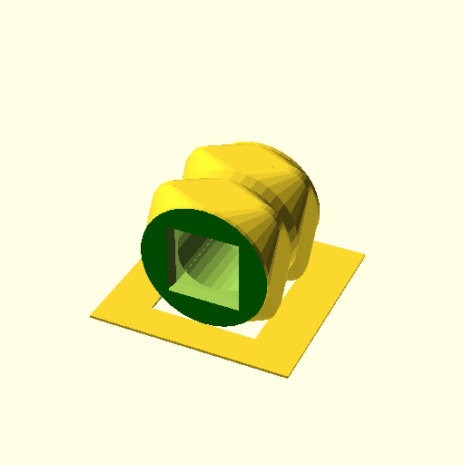
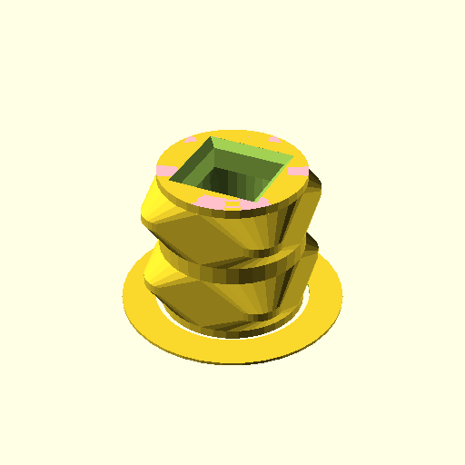
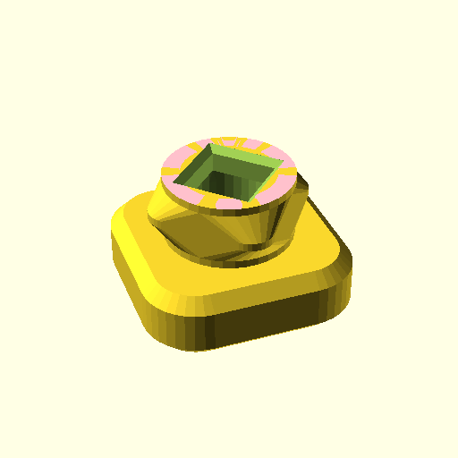
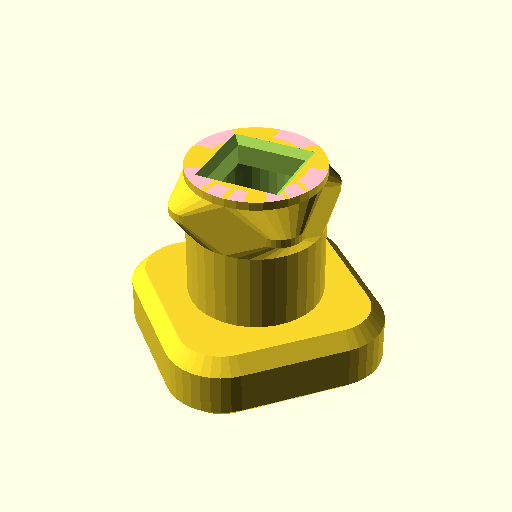
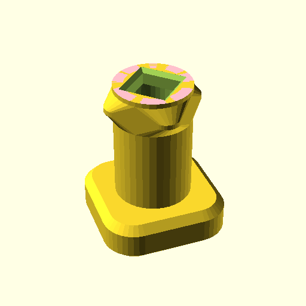
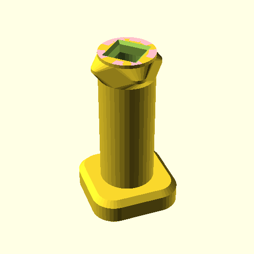
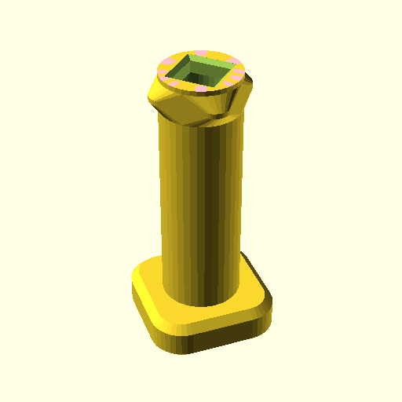
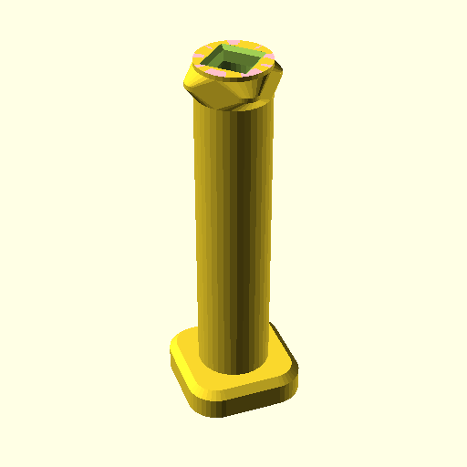
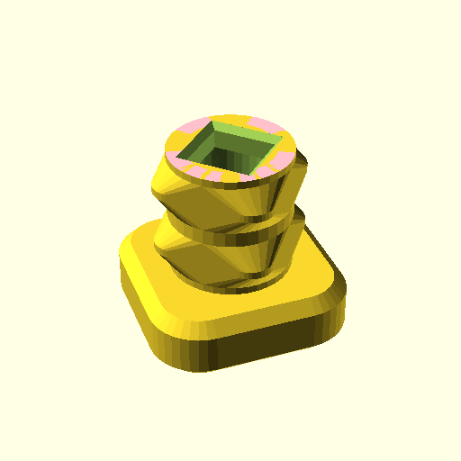
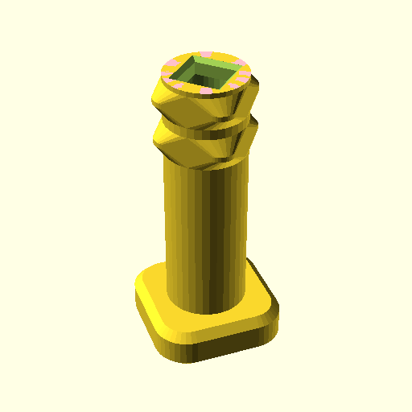

# Connectors

**BB20ConSide();**

    use <BB20_connector.scad>
    BB20ConSide();

[BB20ConSide.3mf](BB20ConSide.3mf) [BB20ConSide.stl](BB20ConSide.stl)

**BB20ConNoHead();**

    use <BB20_connector.scad>
    BB20ConNoHead();

[BB20ConNoHead.3mf](BB20ConNoHead.3mf) [BB20ConNoHead.stl](BB20ConNoHead.stl)

**BB20Con(10);**

    use <BB20_connector.scad>
    BB20Con(10);

[BB20Con_10.3mf](BB20Con_10.3mf) [BB20Con_10.stl](BB20Con_10.stl)

**BB20Con(15);**

    use <BB20_connector.scad>
    BB20Con(15);

[BB20Con_15.3mf](BB20Con_15.3mf) [BB20Con_15.stl](BB20Con_15.stl)

**BB20Con(20);**

    use <BB20_connector.scad>
    BB20Con(20);

[BB20Con_20.3mf](BB20Con_20.3mf) [BB20Con_20.stl](BB20Con_20.stl)

**BB20Con(30);**

    use <BB20_connector.scad>
    BB20Con(30);

[BB20Con_30.3mf](BB20Con_30.3mf) [BB20Con_30.stl](BB20Con_30.stl)

**BB20Con(35);**

    use <BB20_connector.scad>
    BB20Con(35);

[BB20Con_35.3mf](BB20Con_35.3mf) [BB20Con_35.stl](BB20Con_35.stl)

**BB20Con(50);**

    use <BB20_connector.scad>
    BB20Con(50);

[BB20Con_50.3mf](BB20Con_50.3mf) [BB20Con_50.stl](BB20Con_50.stl)

**BB20Con(15,2);**

    use <BB20_connector.scad>
    BB20Con(15,2);

[BB20Con_15_2.3mf](BB20Con_15_2.3mf) [BB20Con_15_2.stl](BB20Con_15_2.stl)

**BB20Con(30,2);**

    use <BB20_connector.scad>
    BB20Con(30,2);

[BB20Con_30_2.3mf](BB20Con_30_2.3mf) [BB20Con_30_2.stl](BB20Con_30_2.stl)

**BB20Con(35,2);**

    use <BB20_connector.scad>
    BB20Con(35,2);

[BB20Con_35_2.3mf](BB20Con_35_2.3mf) [BB20Con_35_2.stl](BB20Con_35_2.stl)

