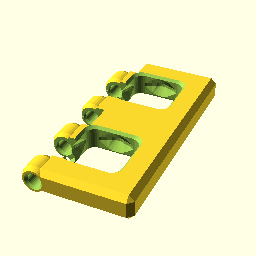

**BB20Window([1,2], "M");**

    use <BB20_doors.scad>
    BB20Window([1,2], "M");

[BB20Window_1x2__M.3mf](BB20Window_1x2__M.3mf)
[BB20Window_1x2__M.stl](BB20Window_1x2__M.stl)

**BB20Window([1,2], "S");**

    use <BB20_doors.scad>
    BB20Window([1,2], "S");

[BB20Window_1x2__S.3mf](BB20Window_1x2__S.3mf)
[BB20Window_1x2__S.stl](BB20Window_1x2__S.stl)

**BB20Window([2,2], "S");**

    use <BB20_doors.scad>
    BB20Window([2,2], "S");

[BB20Window_2x2__S.3mf](BB20Window_2x2__S.3mf)
[BB20Window_2x2__S.stl](BB20Window_2x2__S.stl)

**BB20Door([2,2]);**

    use <BB20_doors.scad>
    BB20Door([2,2]);

[BB20Door_2x2.3mf](BB20Door_2x2.3mf)
[BB20Door_2x2.stl](BB20Door_2x2.stl)

**BB20Door([2,3]);**

    use <BB20_doors.scad>
    BB20Door([2,3]);

[BB20Door_2x3.3mf](BB20Door_2x3.3mf)
[BB20Door_2x3.stl](BB20Door_2x3.stl)

**BB20Door([2,4]);**

    use <BB20_doors.scad>
    BB20Door([2,4]);

[BB20Door_2x4.3mf](BB20Door_2x4.3mf)
[BB20Door_2x4.stl](BB20Door_2x4.stl)

