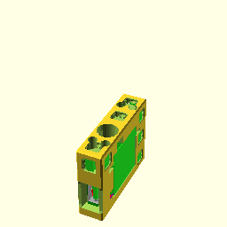

**BB20Servo();**

    use <BB20_electric.scad>
    BB20Servo();

[BB20Servo.3mf](BB20Servo.3mf)
[BB20Servo.stl](BB20Servo.stl)

**BB20MotorFlansch();**

    use <BB20_electric.scad>
    BB20MotorFlansch();

[BB20MotorFlansch.3mf](BB20MotorFlansch.3mf)
[BB20MotorFlansch.stl](BB20MotorFlansch.stl)

