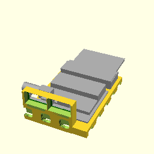
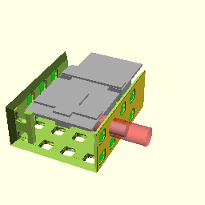

# BB20 electronics
## Pinout
 * Pin 1: SCL1
 * Pin 2: Servo-PWM
 * Pin 3: SDA
 * Pin 4: Motor- (or GND)
 * Pin 5: Motor+ (or VBat  max. +12V)
 * Pin 6: GND
 * Pin 7: 5V
 * Pin 8: GND DATA
 * Pin 9: NeoPixel-IN
 * Pin 10: NeoPixel-OUT

All devices need to connect Pin 9 and Pin 10.

**BB20MotoBitBottom();**

    use <BB20_electric.scad>
    BB20MotoBitBottom();

[BB20MotoBitBottom.3mf](BB20MotoBitBottom.3mf)
[BB20MotoBitBottom.stl](BB20MotoBitBottom.stl)

**BB20MotoBitTop();**

    use <BB20_electric.scad>
    BB20MotoBitTop();

[BB20MotoBitTop.3mf](BB20MotoBitTop.3mf)
[BB20MotoBitTop.stl](BB20MotoBitTop.stl)

