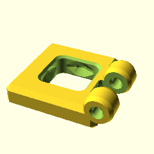
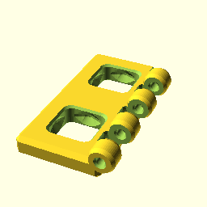
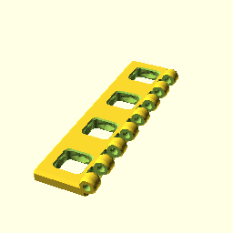
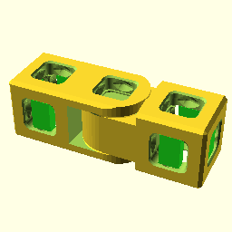
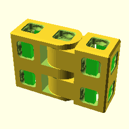

**BB20HingeFlat(1);**

    use <BB20_hinge.scad>
    BB20HingeFlat(1);

[BB20HingeFlat_1.3mf](BB20HingeFlat_1.3mf)
[BB20HingeFlat_1.stl](BB20HingeFlat_1.stl)

**BB20HingeFlat(2);**

    use <BB20_hinge.scad>
    BB20HingeFlat(2);

[BB20HingeFlat_2.3mf](BB20HingeFlat_2.3mf)
[BB20HingeFlat_2.stl](BB20HingeFlat_2.stl)

**BB20HingeFlat(4);**

    use <BB20_hinge.scad>
    BB20HingeFlat(4);

[BB20HingeFlat_4.3mf](BB20HingeFlat_4.3mf)
[BB20HingeFlat_4.stl](BB20HingeFlat_4.stl)

**BB20HingeCube(1);**

    use <BB20_hinge.scad>
    BB20HingeCube(1);

[BB20HingeCube_1.3mf](BB20HingeCube_1.3mf)
[BB20HingeCube_1.stl](BB20HingeCube_1.stl)

**BB20HingeCube(2);**

    use <BB20_hinge.scad>
    BB20HingeCube(2);

[BB20HingeCube_2.3mf](BB20HingeCube_2.3mf)
[BB20HingeCube_2.stl](BB20HingeCube_2.stl)

