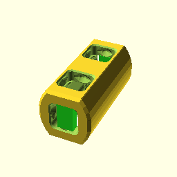
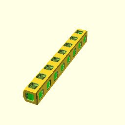
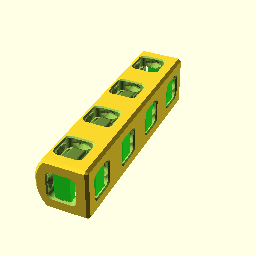
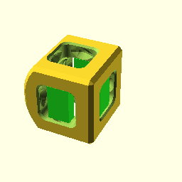

**BB20LogCorner(4);**

    use <BB20_logs.scad>
    BB20LogCorner(4);

[BB20LogCorner_4.3mf](BB20LogCorner_4.3mf)
[BB20LogCorner_4.stl](BB20LogCorner_4.stl)

**BB20LogCorner(3);**

    use <BB20_logs.scad>
    BB20LogCorner(3);

[BB20LogCorner_3.3mf](BB20LogCorner_3.3mf)
[BB20LogCorner_3.stl](BB20LogCorner_3.stl)

**BB20LogCorner(2);**

    use <BB20_logs.scad>
    BB20LogCorner(2);

[BB20LogCorner_2.3mf](BB20LogCorner_2.3mf)
[BB20LogCorner_2.stl](BB20LogCorner_2.stl)

**BB20LogCorner(1);**

    use <BB20_logs.scad>
    BB20LogCorner(1);

[BB20LogCorner_1.3mf](BB20LogCorner_1.3mf)
[BB20LogCorner_1.stl](BB20LogCorner_1.stl)

**BB20LogDouble(1);**

    use <BB20_logs.scad>
    BB20LogDouble(1);

[BB20LogDouble_1.3mf](BB20LogDouble_1.3mf)
[BB20LogDouble_1.stl](BB20LogDouble_1.stl)

**BB20LogDouble(2);**

    use <BB20_logs.scad>
    BB20LogDouble(2);

[BB20LogDouble_2.3mf](BB20LogDouble_2.3mf)
[BB20LogDouble_2.stl](BB20LogDouble_2.stl)

**BB20LogDouble(3);**

    use <BB20_logs.scad>
    BB20LogDouble(3);

[BB20LogDouble_3.3mf](BB20LogDouble_3.3mf)
[BB20LogDouble_3.stl](BB20LogDouble_3.stl)

**BB20LogDouble(4);**

    use <BB20_logs.scad>
    BB20LogDouble(4);

[BB20LogDouble_4.3mf](BB20LogDouble_4.3mf)
[BB20LogDouble_4.stl](BB20LogDouble_4.stl)

**BB20LogDouble(8);**

    use <BB20_logs.scad>
    BB20LogDouble(8);

[BB20LogDouble_8.3mf](BB20LogDouble_8.3mf)
[BB20LogDouble_8.stl](BB20LogDouble_8.stl)

**BB20LogSingle(8);**

    use <BB20_logs.scad>
    BB20LogSingle(8);

[BB20LogSingle_8.3mf](BB20LogSingle_8.3mf)
[BB20LogSingle_8.stl](BB20LogSingle_8.stl)

**BB20LogSingle(4);**

    use <BB20_logs.scad>
    BB20LogSingle(4);

[BB20LogSingle_4.3mf](BB20LogSingle_4.3mf)
[BB20LogSingle_4.stl](BB20LogSingle_4.stl)

**BB20LogSingle(3);**

    use <BB20_logs.scad>
    BB20LogSingle(3);

[BB20LogSingle_3.3mf](BB20LogSingle_3.3mf)
[BB20LogSingle_3.stl](BB20LogSingle_3.stl)

**BB20LogSingle(2);**

    use <BB20_logs.scad>
    BB20LogSingle(2);

[BB20LogSingle_2.3mf](BB20LogSingle_2.3mf)
[BB20LogSingle_2.stl](BB20LogSingle_2.stl)

**BB20LogSingle(1);**

    use <BB20_logs.scad>
    BB20LogSingle(1);

[BB20LogSingle_1.3mf](BB20LogSingle_1.3mf)
[BB20LogSingle_1.stl](BB20LogSingle_1.stl)

**BB20LogHalf(1);**

    use <BB20_logs.scad>
    BB20LogHalf(1);

[BB20LogHalf_1.3mf](BB20LogHalf_1.3mf)
[BB20LogHalf_1.stl](BB20LogHalf_1.stl)

**BB20LogHalf(2);**

    use <BB20_logs.scad>
    BB20LogHalf(2);

[BB20LogHalf_2.3mf](BB20LogHalf_2.3mf)
[BB20LogHalf_2.stl](BB20LogHalf_2.stl)

**BB20LogHalf(3);**

    use <BB20_logs.scad>
    BB20LogHalf(3);

[BB20LogHalf_3.3mf](BB20LogHalf_3.3mf)
[BB20LogHalf_3.stl](BB20LogHalf_3.stl)

**BB20LogHalf(4);**

    use <BB20_logs.scad>
    BB20LogHalf(4);

[BB20LogHalf_4.3mf](BB20LogHalf_4.3mf)
[BB20LogHalf_4.stl](BB20LogHalf_4.stl)

**BB20LogHalf(8);**

    use <BB20_logs.scad>
    BB20LogHalf(8);

[BB20LogHalf_8.3mf](BB20LogHalf_8.3mf)
[BB20LogHalf_8.stl](BB20LogHalf_8.stl)

**BB20LogHalfCorner(1);**

    use <BB20_logs.scad>
    BB20LogHalfCorner(1);

[BB20LogHalfCorner_1.3mf](BB20LogHalfCorner_1.3mf)
[BB20LogHalfCorner_1.stl](BB20LogHalfCorner_1.stl)

**BB20LogHalfCorner(2);**

    use <BB20_logs.scad>
    BB20LogHalfCorner(2);

[BB20LogHalfCorner_2.3mf](BB20LogHalfCorner_2.3mf)
[BB20LogHalfCorner_2.stl](BB20LogHalfCorner_2.stl)

**BB20LogHalfCorner(3);**

    use <BB20_logs.scad>
    BB20LogHalfCorner(3);

[BB20LogHalfCorner_3.3mf](BB20LogHalfCorner_3.3mf)
[BB20LogHalfCorner_3.stl](BB20LogHalfCorner_3.stl)

**BB20LogHalfCorner(4);**

    use <BB20_logs.scad>
    BB20LogHalfCorner(4);

[BB20LogHalfCorner_4.3mf](BB20LogHalfCorner_4.3mf)
[BB20LogHalfCorner_4.stl](BB20LogHalfCorner_4.stl)

**BB20LogHalfCorner(8);**

    use <BB20_logs.scad>
    BB20LogHalfCorner(8);

[BB20LogHalfCorner_8.3mf](BB20LogHalfCorner_8.3mf)
[BB20LogHalfCorner_8.stl](BB20LogHalfCorner_8.stl)

