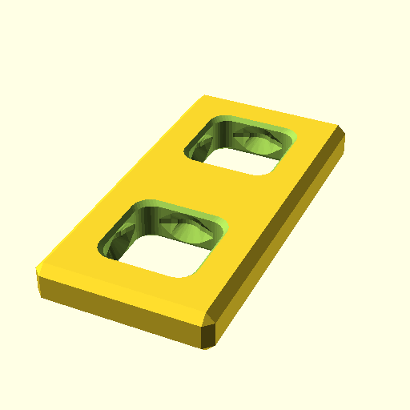
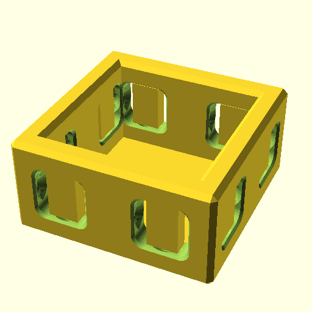

**BB20Plate([1,2]);**

    use <BB20_plates.scad>
    BB20Plate([1,2]);

[BB20Plate_1x2.3mf](BB20Plate_1x2.3mf)
[BB20Plate_1x2.stl](BB20Plate_1x2.stl)

**BB20Plate([1,3]);**

    use <BB20_plates.scad>
    BB20Plate([1,3]);

[BB20Plate_1x3.3mf](BB20Plate_1x3.3mf)
[BB20Plate_1x3.stl](BB20Plate_1x3.stl)

**BB20Plate([1,4]);**

    use <BB20_plates.scad>
    BB20Plate([1,4]);

[BB20Plate_1x4.3mf](BB20Plate_1x4.3mf)
[BB20Plate_1x4.stl](BB20Plate_1x4.stl)

**BB20Plate([2,2]);**

    use <BB20_plates.scad>
    BB20Plate([2,2]);

[BB20Plate_2x2.3mf](BB20Plate_2x2.3mf)
[BB20Plate_2x2.stl](BB20Plate_2x2.stl)

**BB20Plate([2,4]);**

    use <BB20_plates.scad>
    BB20Plate([2,4]);

[BB20Plate_2x4.3mf](BB20Plate_2x4.3mf)
[BB20Plate_2x4.stl](BB20Plate_2x4.stl)

**BB20Plate([4,4]);**

    use <BB20_plates.scad>
    BB20Plate([4,4]);

[BB20Plate_4x4.3mf](BB20Plate_4x4.3mf)
[BB20Plate_4x4.stl](BB20Plate_4x4.stl)

**BB20Plate([4,8]);**

    use <BB20_plates.scad>
    BB20Plate([4,8]);

[BB20Plate_4x8.3mf](BB20Plate_4x8.3mf)
[BB20Plate_4x8.stl](BB20Plate_4x8.stl)

**BB20PlateR([1,4]);**

    use <BB20_plates.scad>
    BB20PlateR([1,4]);

[BB20PlateR_1x4.3mf](BB20PlateR_1x4.3mf)
[BB20PlateR_1x4.stl](BB20PlateR_1x4.stl)

**BB20PlateR([1,3]);**

    use <BB20_plates.scad>
    BB20PlateR([1,3]);

[BB20PlateR_1x3.3mf](BB20PlateR_1x3.3mf)
[BB20PlateR_1x3.stl](BB20PlateR_1x3.stl)

**BB20PlateR([1,4]);**

    use <BB20_plates.scad>
    BB20PlateR([1,4]);

[BB20PlateR_1x4.3mf](BB20PlateR_1x4.3mf)
[BB20PlateR_1x4.stl](BB20PlateR_1x4.stl)

**BB20PlateR([2,2]);**

    use <BB20_plates.scad>
    BB20PlateR([2,2]);

[BB20PlateR_2x2.3mf](BB20PlateR_2x2.3mf)
[BB20PlateR_2x2.stl](BB20PlateR_2x2.stl)

**BB20PlateR([2,4]);**

    use <BB20_plates.scad>
    BB20PlateR([2,4]);

[BB20PlateR_2x4.3mf](BB20PlateR_2x4.3mf)
[BB20PlateR_2x4.stl](BB20PlateR_2x4.stl)

**BB20Panel([2,2,1]);**

    use <BB20_plates.scad>
    BB20Panel([2,2,1]);

[BB20Panel_2x2x1.3mf](BB20Panel_2x2x1.3mf)
[BB20Panel_2x2x1.stl](BB20Panel_2x2x1.stl)

**BB20Panel([1,2,1]);**

    use <BB20_plates.scad>
    BB20Panel([1,2,1]);

[BB20Panel_1x2x1.3mf](BB20Panel_1x2x1.3mf)
[BB20Panel_1x2x1.stl](BB20Panel_1x2x1.stl)

**BB20Panel([1,3,1]);**

    use <BB20_plates.scad>
    BB20Panel([1,3,1]);

[BB20Panel_1x3x1.3mf](BB20Panel_1x3x1.3mf)
[BB20Panel_1x3x1.stl](BB20Panel_1x3x1.stl)

**BB20Panel([1,4,1]);**

    use <BB20_plates.scad>
    BB20Panel([1,4,1]);

[BB20Panel_1x4x1.3mf](BB20Panel_1x4x1.3mf)
[BB20Panel_1x4x1.stl](BB20Panel_1x4x1.stl)

**BB20Panel([2,4,1]);**

    use <BB20_plates.scad>
    BB20Panel([2,4,1]);

[BB20Panel_2x4x1.3mf](BB20Panel_2x4x1.3mf)
[BB20Panel_2x4x1.stl](BB20Panel_2x4x1.stl)

**BB20Panel([4,4,1]);**

    use <BB20_plates.scad>
    BB20Panel([4,4,1]);

[BB20Panel_4x4x1.3mf](BB20Panel_4x4x1.3mf)
[BB20Panel_4x4x1.stl](BB20Panel_4x4x1.stl)

