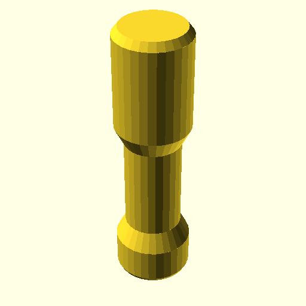
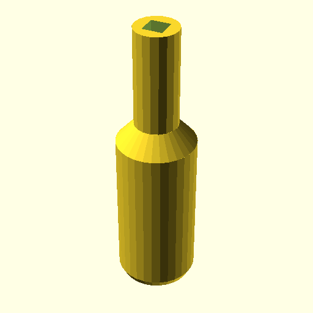
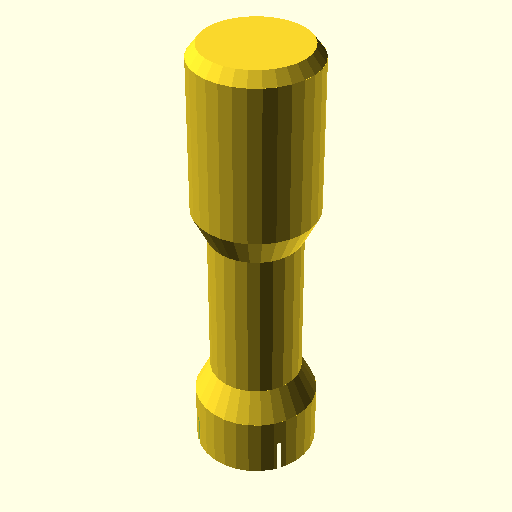

**BB20Tool1();**

    use <BB20_tool.scad>
    BB20Tool1();

[BB20Tool1.3mf](BB20Tool1.3mf)
[BB20Tool1.stl](BB20Tool1.stl)

**BB20Tool2();**

    use <BB20_tool.scad>
    BB20Tool2();

[BB20Tool2.3mf](BB20Tool2.3mf)
[BB20Tool2.stl](BB20Tool2.stl)

**BB20Tool3();**

    use <BB20_tool.scad>
    BB20Tool3();

[BB20Tool3.3mf](BB20Tool3.3mf)
[BB20Tool3.stl](BB20Tool3.stl)

**BB20Tool4();**

    use <BB20_tool.scad>
    BB20Tool4();

[BB20Tool4.3mf](BB20Tool4.3mf)
[BB20Tool4.stl](BB20Tool4.stl)

