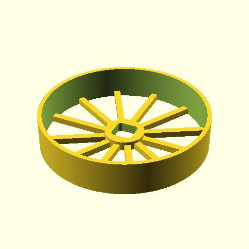

**BB20_SimpleWheel(80);**

    use <BB20_wheel.scad>
    BB20_SimpleWheel(80);

[BB20_SimpleWheel_80.3mf](BB20_SimpleWheel_80.3mf)
[BB20_SimpleWheel_80.stl](BB20_SimpleWheel_80.stl)

**BB20_SimpleWheel(40);**

    use <BB20_wheel.scad>
    BB20_SimpleWheel(40);

[BB20_SimpleWheel_40.3mf](BB20_SimpleWheel_40.3mf)
[BB20_SimpleWheel_40.stl](BB20_SimpleWheel_40.stl)

